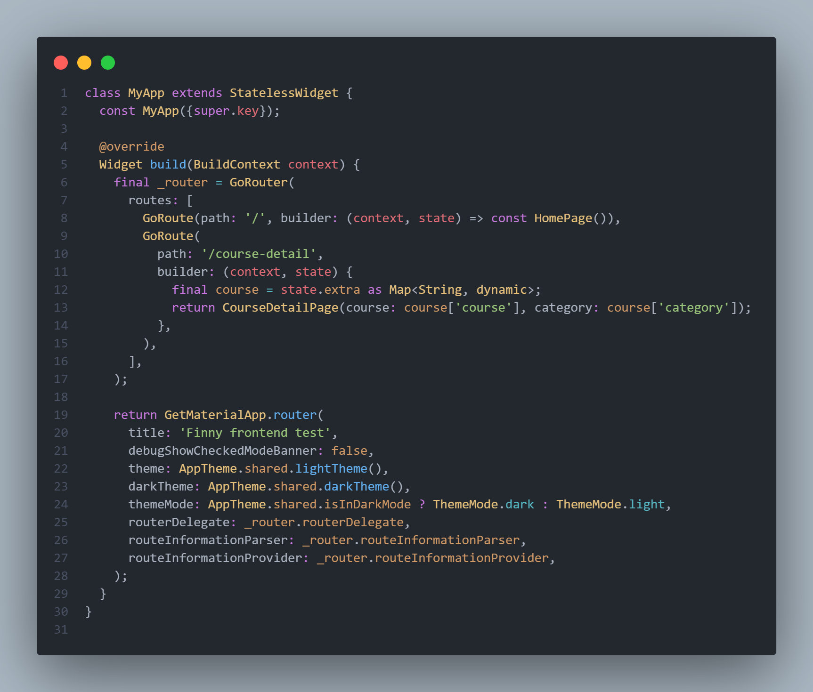
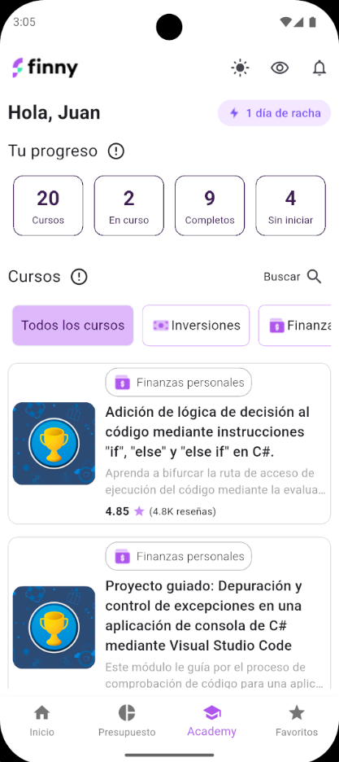
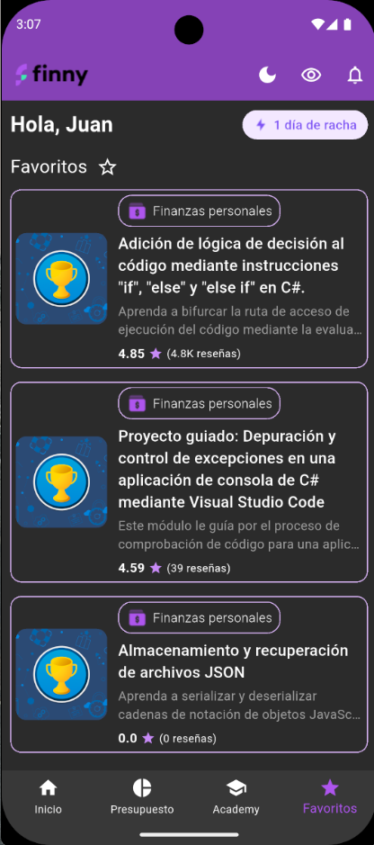
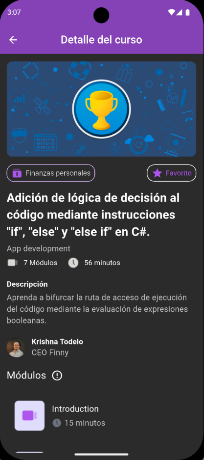

# Finny frontend mobile test

## Ejecución del proyecto [Video]()

### Prerrequisitos:

- Se debe tener instalado el SDK de flutter, también se debe tener instalado Android Studio para activar un dispositivo virtual activo o en su defecto, tener conectado un móvil android con modo desarrollador y depuración USB activada. 

- Se recomienta Android debido a que este test en particular se trabajó en windows por lo que la prueba de ejecución en un dispositivo iOS aunque no debería dar inconveniente no está garantizada.

### Ejecución

1. Para ejecutar el proyecto es necesario clonar el repositorio o descargarlo comprimido en zip.

2. Se deben descargar los módulos con `flutter pub get`.

3. Tener un emulador o dispositivo físico listo, seleccionarlo y ejecutar `flutter run`.

## Deciciones técnicas

### Arquitectura

- Para este proyecto se decidió utilizar una arquitectura limpia (simplificada), en la cual se delegaran las responsabilidades de ui, gestión de estados, lógica de negocio, datos y utilidades. Considero que es una arquitectura simplificada para el tipo de proyecto ya que dentro de la carpeta `lib` encontraremos las siguientes carpetas:

- UI

 1.  `pages` Dentro se encuentran carpetas, cada una contiene los archivos que se encargan de dar vida visual a la aplicación.
 
 2. `widgets` Widgets reutilizables, no tienen una lógica de negocio específica. 

- Datos
 
 3. `models` Contiene las clases que representan las entidades/objetos y dentro las propiedades que los componen.

 4. `repositories` Lógica de datos que se almacenan o se obtienen de la memoria interna del dispositivo. Específicamente se utilizó [sqflite](https://pub.dev/packages/sqflite)

 5. `services`Lógica de datos externos a la aplicación, en este caso los consultados a través del API. Dependencia utilizada: [http](https://pub.dev/packages/http)

- Estados

 6.  `providers` Clases dedicadas a manejar los estados de la aplicación, en esta aplicación el gestor de estados utilizados fué [provider](https://pub.dev/packages/provider)

 - Utilidades
 7.   `utils` Clases encargadas de contener métodos o variables globales utiles en toda la aplicación.

 8. `themes` Contiene las definiciones y especificaciones de los temas claro y oscuro de la aplicación.

 ### Funcionalidades clave

 - **Gestión de estado y gestión de temas:** Se utilizan 2 dependencias que se pueden utilizar para gestionar estados, [get](https://pub.dev/packages/get) y [provider](https://pub.dev/packages/provider), se decidió así para mostrar las bondades de ambas, aunque en un proyecto se puede decidir con cual trabajar. Yo la verdad recomiendo ambas. Por ejempo get se utilizó para administrar el modo oscuro y claro, también par acceder al contexto, datos de la interfaz como ancho y alto total (cosas que no tiene provider). Y provider se utilizó para la gestión del estado de las 3 páginas principales (lista de cursos, cursos favoritos y detalle de curso) debido a que su integración y reacción es excelente.

 - **Consumo de API:** Se utilizó [http](https://pub.dev/packages/http) por su fácil integración y excelente rendimiento.

 - **Gestión de rutas:** Esto es algo para lo cual también prefiero [get](https://pub.dev/packages/get) su desempeño en rutas móviles y web es genial. Pero en este caso se utilizó [goRouter](https://pub.dev/packages/go_router) para ver de primera mano su integración.

 - **Persistencia local de datos:** [sqflite](https://pub.dev/packages/sqflite) fué la herramienta para almacenar los cursos favoritos, este crea basicamente una base de datos sql minificada en el dispositivo, con una respuesta de consulta excelente y con las bondades que ofrece cualquier base de datos, como queries un poco mas complejos. Y para el almacenamiento del modo oscuro (recordar la decisión del usuario) se utilizó [shared_preferences](https://pub.dev/packages/shared_preferences), esta dependencia es funcional para este tipo de datos simples como booleans.

- **Diseño, manejo visual de errores o data vacía, navegador, botones, íconos, etc:** Todo estó fué manejado enteramente con los widgets que ya trae flutter. La maquetación se realizó con base al Figma provisto, y el modo oscuro fué hecho a criterio personal.

<table>
  <tr>
    <td></td>
    <td></td>
  </tr>
  <tr>
    <td></td>
    <td></td>
  </tr>
</table>

